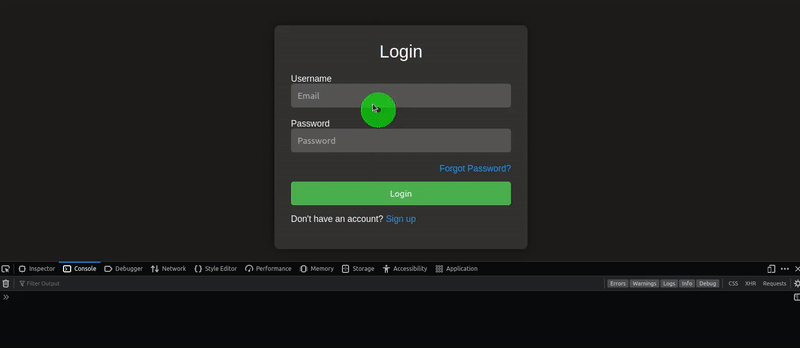

# 📚 Yew Components


[](https://app.netlify.com/sites/yew-components/deploys)
[](https://github.com/wiseaidev)
[](https://opensource.org/licenses/Apache-2.0)
[](https://www.rust-lang.org/)
[](https://reddit.com/submit?url=https://github.com/wiseaidev/yew-components&amp;title=A%20Collection%20of%20Reusable%20Yew%20Framework%20Components.)
[](https://news.ycombinator.com/submitlink?u=https://github.com/wiseaidev/yew-components&amp;t=A%20Collection%20of%20Reusable%20Yew%20Framework%20Components.)
[](https://twitter.com/share?url=https://github.com/wiseaidev/yew-components&amp;text=A%20Collection%20of%20Reusable%20Yew%20Framework%20Components.)
[](https://www.facebook.com/sharer/sharer.php?u=https://github.com/wiseaidev/yew-components)
[](https://www.linkedin.com/shareArticle?url=https://github.com/wiseaidev/yew-components&amp;title=A%20Collection%20of%20Reusable%20Yew%20Framework%20Components.)

This repository contains a collection of reusable components written in Rust for the Yew framework. The components cover a range of functionalities, from login and register forms to contact us, forget password forms, etc. Each component is implemented using different CSS frameworks like Bootstrap, Tailwind CSS, PostCSS, or even in just pure CSS, providing flexibility and ease of integration.

## 📖 Prologue

[Yew](yew.rs) is a modern Rust framework for building multi-threaded front-end web applications. It aims to provide a productive and pleasant experience for developing front-end applications in Rust, leveraging its safety and performance benefits. By utilizing Yew, we can create interactive and efficient web applications with ease.

## 🚀 Building and Running

1. Fork/Clone the GitHub repository.

	```bash
	git clone https://github.com/wiseaidev/yew-components
	```

1. Navigate to the application directory.

	```bash
	cd yew-components
	```

1. Run the client:

	```sh
	trunk serve --port 3000
	```

Navigate to http://localhost:3000 to explore all available components.

## 📂 Components

This section provides detailed information about the individual components included in the repository. The components are organized based on the CSS framework used for their implementation.

### 🎨 Pure CSS Components

This subsection lists components implemented using just pure CSS. Pure CSS components provide a lightweight and minimalistic approach to styling web applications. Each component is designed without relying on external libraries, making them easy to integrate into any project.

| ID | Demo | Live Demo | Repository | Localhost |
|---|---|---|---|---|
| 1 |  | [Live Demo](https://yew-components.netlify.app/pure-css/1) | [Repo](link-to-repo) | [Localhost](http://localhost:3000/pure-css/1) |

### 📙 Bootstrap Components

This subsection lists components implemented using the [Bootstrap CSS](https://getbootstrap.com/) framework. Bootstrap is a popular front-end framework that provides a rich set of components and styles, allowing developers to build responsive and visually appealing web applications.

| ID | Demo | Live Demo | Repository | Localhost |
|-----|---|---|---|---|
| 1 |  | [Live Demo](link-to-live-demo) | [Repo](link-to-repo) | [Localhost](link-to-relocalhosto) |

### 🌀 Tailwind CSS Components

This subsection lists components implemented using the [Tailwind CSS](https://tailwindcss.com/) framework. Tailwind CSS is a utility-first CSS framework that provides a set of pre-defined classes to quickly build custom and responsive designs.

| ID | Demo | Live Demo | Repository | Localhost |
|-----|---|---|---|---|
| 1 |  | [Live Demo](link-to-live-demo) | [Repo](link-to-repo) | [Localhost](link-to-relocalhosto) |

### 🌈 Bulma CSS Components

This subsection lists components implemented using the [Bulma CSS](https://bulma.io/) framework. Bulma CSS is a modern and modular CSS framework that offers a wide range of components and utilities.

| ID | Demo | Live Demo | Repository | Localhost |
|-----|---|---|---|---|
| 1 |  | [Live Demo](link-to-live-demo) | [Repo](link-to-repo) | [Localhost](link-to-relocalhosto) |

## 🤝 Contributing

We welcome contributions to enhance the Rust Data Analysis repository! To contribute, please follow the [`CONTRIBUING.md`](CONTRIBUING.md) file guidelines. Thank you for helping make this project better!

## 📜 License

This project and the accompanying materials are made available under the terms and conditions of the [` Apache License Version 2.0`](https://github.com/wiseaidev/yew-components/blob/main/LICENSE).

## 📝 Epilogue

In conclusion, this repository is a treasure trove of reusable components crafted in Rust for the Yew framework, offering a plethora of functionalities ranging from user authentication to contact forms and more. Each component showcases the capabilities of different CSS frameworks like Bootstrap, Tailwind CSS, Bulma CSS, and even Pure CSS. Whether you're a Rust enthusiast or a front-end developer seeking powerful and flexible components, this collection has something to offer.

Happy coding! 🚀